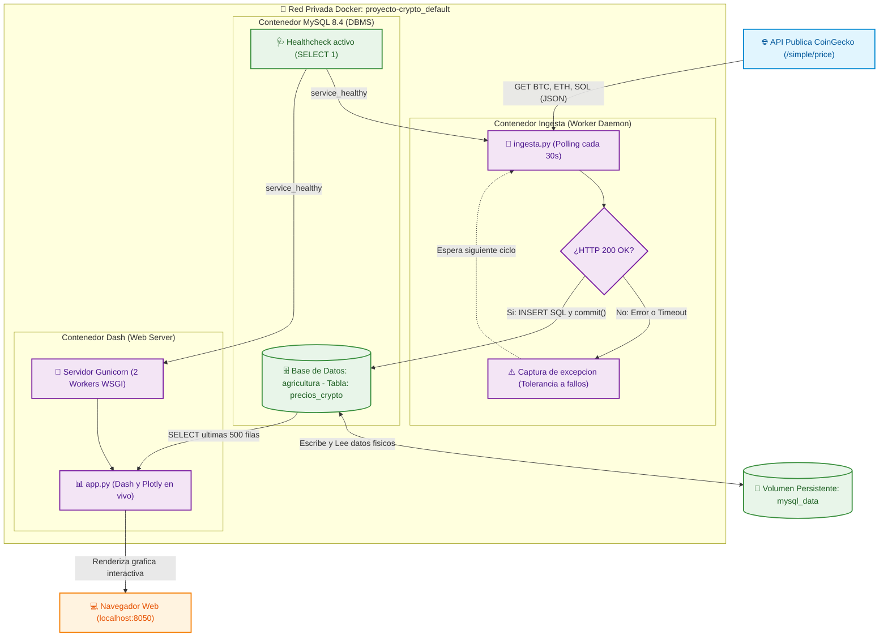

```mermaid
flowchart TD
    %% Estilos
    classDef external fill:#e1f5fe,stroke:#0288d1,stroke-width:2px,color:#01579b;
    classDef container fill:#f3e5f5,stroke:#7b1fa2,stroke-width:2px,color:#4a148c;
    classDef storage fill:#e8f5e9,stroke:#388e3c,stroke-width:2px,color:#1b5e20;
    classDef client fill:#fff3e0,stroke:#f57c00,stroke-width:2px,color:#e65100;

    %% Nodos externos
    API["🌐 API Publica CoinGecko (/simple/price)"]:::external
    USER["💻 Navegador Web (localhost:8050)"]:::client

    %% Red Docker
    subgraph DOCKER_NET ["🐳 Red Privada Docker: proyecto-crypto_default"]
        
        subgraph S_INGESTA ["Contenedor Ingesta (Worker Daemon)"]
            I_WORKER["🐍 ingesta.py (Polling cada 30s)"]:::container
            I_RETRY{"¿HTTP 200 OK?"}:::container
            I_ERR["⚠️ Captura de excepcion (Tolerancia a fallos)"]:::container
        end

        subgraph S_MYSQL ["Contenedor MySQL 8.4 (DBMS)"]
            DB_HEALTH["🩺 Healthcheck activo (SELECT 1)"]:::storage
            DB_ENGINE[("🗄️ Base de Datos: agricultura - Tabla: precios_crypto")]:::storage
        end

        subgraph S_DASH ["Contenedor Dash (Web Server)"]
            D_GUNICORN["🚀 Servidor Gunicorn (2 Workers WSGI)"]:::container
            D_APP["📊 app.py (Dash y Plotly en vivo)"]:::container
        end

    end

    %% Persistencia
    VOLUME[("💾 Volumen Persistente: mysql_data")]:::storage

    %% Flujos de Ingesta
    API -->|"GET BTC, ETH, SOL (JSON)"| I_WORKER
    I_WORKER --> I_RETRY
    I_RETRY -->|"No: Error o Timeout"| I_ERR
    I_ERR -.->|"Espera siguiente ciclo"| I_WORKER
    I_RETRY -->|"Si: INSERT SQL y commit()"| DB_ENGINE

    %% Orquestacion y Dependencias
    DB_HEALTH -->|"service_healthy"| I_WORKER
    DB_HEALTH -->|"service_healthy"| D_GUNICORN

    %% Flujos de Base de Datos y Persistencia
    DB_ENGINE <-->|"Escribe y Lee datos fisicos"| VOLUME

    %% Flujos de Visualizacion
    D_GUNICORN --> D_APP
    DB_ENGINE -->|"SELECT ultimas 500 filas"| D_APP
    D_APP -->|"Renderiza grafica interactiva"| USER
```